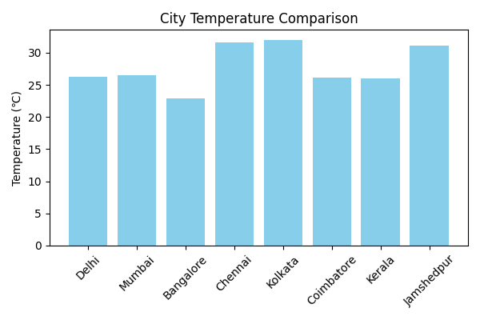
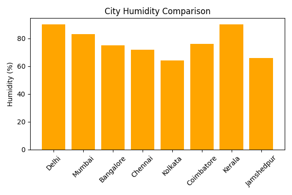

# ☀️ Weather Dashboard

A **Python Tkinter application** that displays real-time weather data for multiple cities around the world.  
It fetches weather information from the **OpenWeatherMap API**, shows it in a table, and visualizes the data with **interactive Matplotlib charts** — both inside the app and saved as PNG images in your project folder.

## Features

- 📡 **Real-time weather data** for multiple cities  
- 🌡 **Temperature comparison chart**  
- 💧 **Humidity comparison chart**  
- 🖼 Charts displayed **inside the app** and also **saved to PNG files** automatically  
- 🔄 **Auto-refresh every minute** or manual refresh via a button  
- 🖥 Simple & clean Tkinter GUI  

## Screenshot

**Main Dashboard View**


**Humidity Comparison**



## 🚀 How It Works

1. The app calls the **OpenWeatherMap API** to get:
   - City Name
   - Temperature (°C)
   - Humidity (%)
   - Weather Condition Description
2. Displays data in a **Treeview table**
3. Generates:
   - **Temperature comparison bar chart**
   - **Humidity comparison bar chart**
4. Shows both charts **inside the Tkinter window**
5. Saves the charts as:
   - `temperature_chart.png`
   - `humidity_chart.png`
## ⚙ Technologies Used

- Python 3

- Tkinter — GUI framework

- Requests — API calls

- Pandas — Data handling

- Matplotlib — Chart plotting
## 🏆 Credits

- Developed by Rahul Sharma

- Data powered by OpenWeatherMap
## 🛠 Installation & Setup

### 1️⃣ Clone the Repository
```bash
git clone https://github.com/yourusername/global-weather-dashboard.git
cd global-weather-dashboard